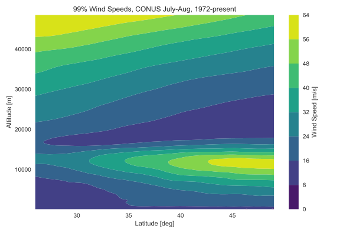

# Wind_Analysis
 
By Peter Sharpe

## Description

Statistical models for high-altitude winds over the CONUS in the summertime. By high-altitude, we just mean "outside of Earth's boundary layer", so at least 1-2km of altitude.

## Model

In code, the model looks like:

```python
def wind_speed_conus_summer_99(altitude, latitude):
    """
    Returns the 99th-percentile wind speed magnitude over the continental United States (CONUS) in July-Aug. Aggregate of data from 1972 to 2019.
    :param altitude: altitude [m]
    :param latitude: latitude [deg]
    :return: 99th-percentile wind speed over the continental United States in the summertime. [m/s]
    """
    l = (latitude - 37.5) / 11.5
    a = (altitude - 24200) / 24200

    agc = -0.5363486000267786
    agh = 1.9569754777072828
    ags = 0.1458701999734713
    aqc = -1.4645014948089652
    c0 = -0.5169694086686631
    c12 = 0.0849519807021402
    c21 = -0.0252010113059998
    c4a = 0.0225856848053377
    c4c = 1.0281877353734501
    cg = 0.8050736230004489
    cgc = 0.2786691793571486
    cqa = 0.1866078047914259
    cql = 0.0165126852561671
    cqla = -0.1361667658248024
    lgc = 0.6943655538727291
    lgh = 2.0777449841036777
    lgs = 0.9805766577269118
    lqc = 4.0356834595743214

    s = c0 + cql * (l - lqc) ** 2 + cqa * (a - aqc) ** 2 + cqla * a * l + cg * exp(
        -(abs(l - lgc) ** lgh / (2 * lgs ** 2) + abs(a - agc) ** agh / (
                    2 * ags ** 2) + cgc * a * l)) + c4a * (
                a - c4c) ** 4 + c12 * l * a ** 2 + c21 * l ** 2 * a

    speed = s * 56 + 7
    return speed
```

## Results



