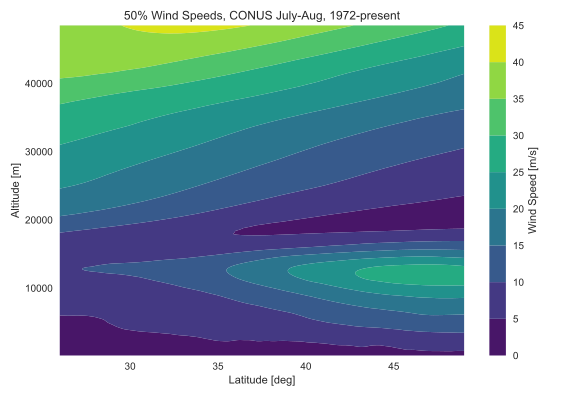
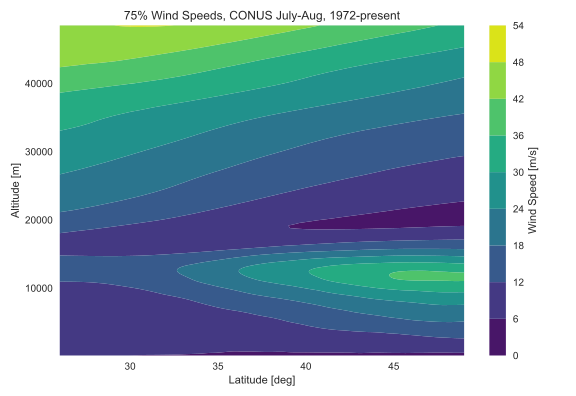
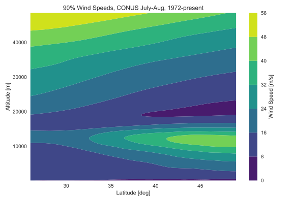
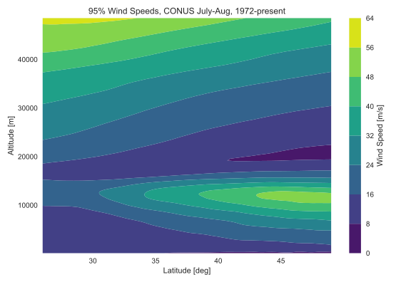
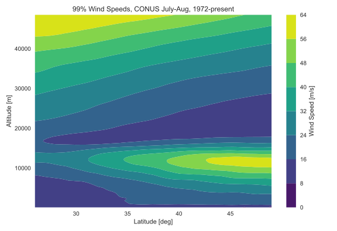

# Wind_Analysis
 
By Peter Sharpe

## Description

Statistical models for high-altitude winds over the CONUS in the summertime. By high-altitude, we just mean "outside of Earth's boundary layer", so at least 1-2km of altitude.

## Results

